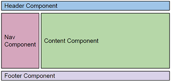

#   [Code Hub](https://www.codehub.gr/) - Angular Courses (instructor: [Fanis Prodromou](https://github.com/profanis))
Simple exercises on the basics of Angular.

### exercise #1
Create a module with all the needed components components to illustrate the following.

### exercise #2
* Create a parent component which has a list of items accessible
via a method
* Create a child component which accepts as input the list of the
items from the parent component and displays the list on screen

### exercise #3
The parent should display a list of items only if the child allows it.
Use inline template

### exercise #4
Create a component which will display the message:
*  “Message from OnInit” on the onInit method
*  “Message from AfterViewInit” on the AfterViewInit method

### exercise #5
Create a service which will return an array of items, and inject this
service in a component. The results should be shown in the console

### exercise #6
Create another component and inject the same service

### exercise #7
1. Remove the providedIn: 'root' from service and run the app.
2. Add the service in the providers of each component

### exercise #8
Having the array ["one", "two", "three", "four", "five", "six", "seven",
"eight", "nine", "ten"]

* In a component display on an unordered list the label of each item
* If the item is the first one, display the label “Is First”
* If the item is the last one, display the label “Is Last”
The array should be on a service

### exercise #9
Having the array people: any[] = [{ "name": "Douglas Pace",
"age": 35,
"country": 'MARS'}];

* Display the name of the user in blue, if country is UK
*  Display the name of the user in red, if country is USA
* Display the name of the user in green, if country is HK
* Display the name of the user in black in any other cases

### exercise #10
Create a directive which will highlight a text on hover
and will have the default state on blur

### exercise 11
* Create a service with a method which will return a typed object with
properties:
* date = today
* amount = 1.5
* Consume the service in a component and display the date in format
yyyyMMdd and the amount in format €amount

### exercise 12
Create a pipe which will get as input a date and transforms it by default
to “dd/MM/yyyy”. Use a boolean parameter which if true will return the
time in format “hh:mm:ss” concatenated with the date

### exercise 13
1. Create a service that GETs data from
https://restcountries.eu/rest/v2/
    Create a model with properties:
    * name
    * topLevelDomain
    * alpha2Code
    * alpha3Code
    * capital
    * region
2. Consume the service in a component and display the results in an
inline template